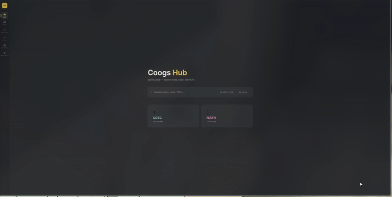
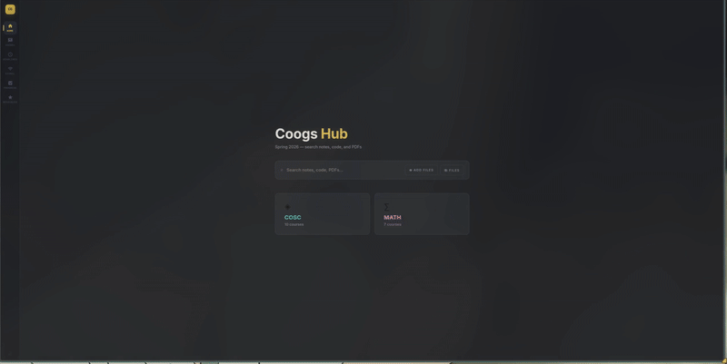
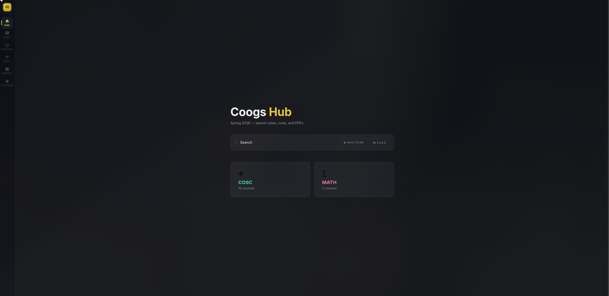

# Coogs Hub

A personal study hub for organizing course notes, code, PDFs, and reference material across CS and math coursework — built as a local-first web app with an upload/ingestion pipeline for dropping in files and auto-sorting them by course.

## Demo





## Stack

- React 19 + Vite
- Express (local file-ingestion server)
- Tauri (desktop packaging)
- Capacitor (Android packaging)

## Features

- Drag-and-drop upload of PDFs, notes, code, and assignments — auto-routed by detected course ID
- In-app viewers for Markdown, HTML, PDF, and code files
- PDF search indexing
- Course roadmap / progress tracking

## Setup

```bash
pnpm install
pnpm dev
```

The Express upload server runs alongside Vite via the config in `vite.config.js`. On first run, copy `src/config/localAuth.example.js` to `src/config/localAuth.js` and set your own `UPLOAD_TOKEN` and `DELETE_CONFIRM_PW` values.

## Scripts

- `pnpm dev` — start dev server
- `pnpm build` — production build
- `pnpm lint` — run eslint
- `pnpm test` — run vitest
- `pnpm reindex` — force-reindex PDFs

## License

AGPL-3.0 — see [LICENSE](./LICENSE).
